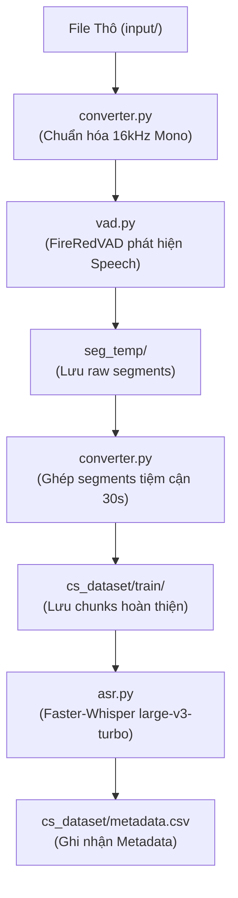

# ASR Dataset Builder Pipeline 🎙️

Pipeline tự động hóa quy trình xây dựng dataset cho các mô hình Nhận Dạng Giọng Nói Tự Động (ASR - Automatic Speech Recognition), đặc biệt tối ưu cho các bài toán **Code-Switching (CS)** và mô hình kiến trúc **Whisper**.

---

## 🌟 Tính Năng Nổi Bật

- **Chuẩn hóa Âm Thanh**: Tự động chuyển đổi các định dạng âm thanh đầu vào (`.wav`, `.mp3`, `.m4a`, `.flac`, `.ogg`...) về chuẩn **16kHz, Mono, 16-bit PCM WAV**.
- **Voice Activity Detection (VAD)**: Tích hợp mô hình SOTA **FireRedVAD** để lọc bỏ khoảng lặng và phát hiện chính xác các phân đoạn có giọng nói.
- **Ghép Phân Đoạn Thông Minh ($\le 30$s)**: Ghép nối tuần tự các segment ngắn theo trình tự thời gian sao cho thời lượng tiệm cận **30 giây** (ngưỡng hoạt động tối ưu nhất của kiến trúc Whisper), tránh phân mảnh dataset.
- **Tự Động Gán Nhãn (Pseudo-Labeling)**: Sử dụng **Faster-Whisper** (`large-v3-turbo`) với hiệu năng cao và hỗ trợ tăng tốc GPU qua CUDA.
- **Xuất Metadata Chuẩn**: Tự động trích xuất và lưu thông tin mẫu vào file `metadata.csv` phục vụ trực tiếp cho quá trình huấn luyện.

---

## 📁 Cấu Trúc Thư Mục

```text
build-cs-dataset/
├── .env                       # File cấu hình biến môi trường
├── .env.example               # Template cấu hình mẫu
├── .gitignore                 # Bỏ qua dataset, model weights và cache
├── requirements.txt           # Danh sách thư viện cần thiết
├── setup_env.ps1              # Script cài đặt môi trường tự động (PowerShell)
├── converter.py               # Xử lý âm thanh & thuật toán nối segment < 30s
├── vad.py                     # Module nhận diện tiếng nói với FireRedVAD
├── asr.py                     # Module phiên dịch với Faster-Whisper
├── main.py                    # Script điều khiển chính (CLI pipeline)
├── input/                     # Thư mục chứa audio đầu vào
├── seg_temp/                  # Thư mục chứa audio trung gian & raw segments
└── cs_dataset/
    ├── train/                 # Thư mục chứa audio chunks hoàn thiện (< 30s)
    └── metadata.csv           # File metadata của dataset
```

---

## ⚙️ Cài Đặt Môi Trường

> **Yêu cầu**: 
> - Hệ điều hành: **Windows 10/11**
> - **Python 3.10+**
> - **FFmpeg**: Đã cài đặt và thêm vào biến môi trường `PATH` của hệ thống.

### 1. Cài đặt tự động (Khuyến nghị)
Mở PowerShell tại thư mục dự án và chạy script:

```powershell
.\setup_env.ps1
```

Script sẽ tự động:
1. Cài đặt các package cần thiết từ `requirements.txt` (bao gồm `torch`, `fireredvad`, `faster-whisper`...).
2. Tải sẵn weights của mô hình `FireRedVAD` về thư mục `pretrained_models/`.

---

## 🛠️ Cấu Hình (`.env`)

Bạn có thể tùy chỉnh các tham số trong file `.env`:

```env
# Thư mục làm việc
INPUT_DIR=input
TEMP_SEG_DIR=seg_temp
OUTPUT_DIR=cs_dataset
TRAIN_DIR=cs_dataset/train
METADATA_FILE=cs_dataset/metadata.csv

# Cấu hình thời lượng & VAD
MAX_CHUNK_DURATION=30.0
VAD_MODEL_DIR=pretrained_models/FireRedVAD/VAD
VAD_SPEECH_THRESHOLD=0.4
VAD_MIN_SPEECH_FRAME=20
VAD_MAX_SPEECH_FRAME=2000

# Cấu hình ASR Model
WHISPER_MODEL=large-v3-turbo
WHISPER_LANG=vi
DEVICE=cuda
COMPUTE_TYPE=float16
```

---

## 🚀 Hướng Dẫn Sử Dụng

### Bước 1: Chuẩn bị file âm thanh
Đặt tất cả các file âm thanh cần tạo dataset vào thư mục `input/`.

### Bước 2: Chạy Pipeline
Sử dụng lệnh `python main.py` và truyền 2 tham số bắt buộc:
- `--type`: Loại dữ liệu (ví dụ: `cs` cho Code-Switching, `mono_vi`, `en_accent_vi`...).
- `--speaker_id`: Định danh người nói (ví dụ: `SPK01`, `speaker_001`...).

**Ví dụ:**
```powershell
python main.py --type "cs" --speaker_id "speaker_001"
```

### Sửa transcript thủ công trên máy

Chạy app review cục bộ (không cần tài khoản và không cần cài package mới):

```powershell
python review_app.py
```

Mở `http://127.0.0.1:8765`. App đọc `cs_dataset/metadata.csv`, phát file tại
`audio_path`, và ghi trực tiếp phần text đã sửa lại vào CSV khi bấm **Lưu thay đổi**.
Có thanh chỉnh tốc độ từ 0.5× đến 2×, thanh chọn bước tua 1–5 giây, `Space` để
phát/dừng, phím mũi tên để tua theo bước đã chọn, và `Ctrl+S` để lưu.

---

## 📊 Định Dạng Metadata (`metadata.csv`)

File `cs_dataset/metadata.csv` được sinh ra với cấu trúc như sau:

| Cột | Ý Nghĩa | Ví Dụ |
| :--- | :--- | :--- |
| `id` | Mã định danh duy nhất (UUID) | `a07dbeda-b7f9-4e27-953a-da6d0393bb83` |
| `audio_path` | Đường dẫn file tương đối trong dataset | `train/audio_sample_0001.wav` |
| `text` | Văn bản phiên dịch từ audio | `Nếu thường xuyên lướt TikTok...` |
| `duration` | Thời lượng file (giây) | `29.94` |
| `type` | Loại dữ liệu phân loại | `cs` |
| `speaker_id` | ID người nói | `speaker_001` |

---

## 📜 Luồng Xử Lý Chi Tiết (Pipeline Flow)


